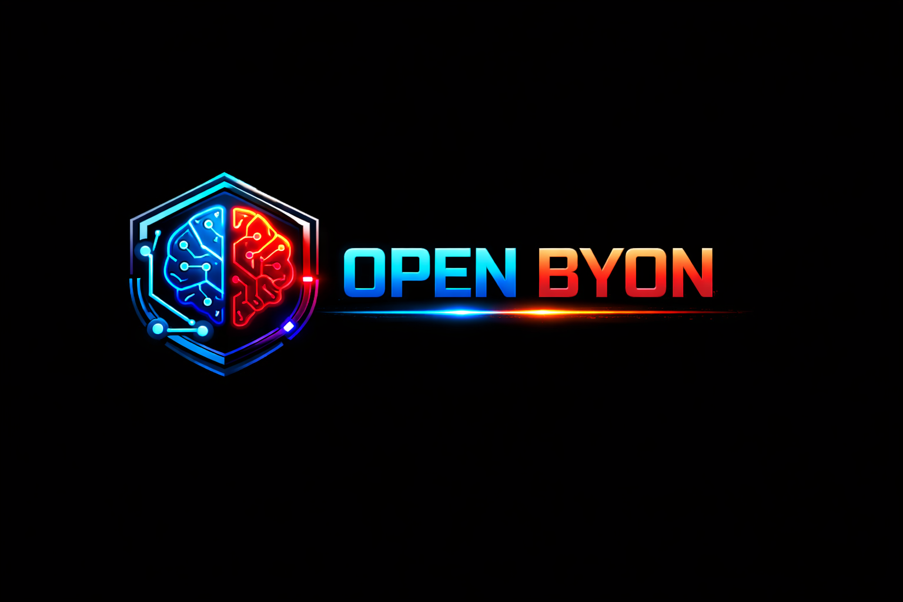

<div align="center">
  
  &nbsp;&nbsp;&nbsp;
  
  &nbsp;&nbsp;&nbsp;
  
</div>

# BYON Optimus - Installation Guide

**Patent: EP25216372.0 - Omni-Qube-Vault - Vasile Lucian Borbeleac**

Complete step-by-step installation tutorial for the BYON Optimus multi-agent orchestration system.

---

## Quick Install (Windows - Automatic)

### Option 1: Double-Click (Easiest)

Just double-click **`INSTALL-CLICK-HERE.bat`** - it will automatically request Administrator privileges via UAC and run the full installation.

**Features:**
- Auto-elevates to Administrator (UAC prompt)
- Handles Docker stderr output gracefully
- Supports paths with quotes or spaces
- Downloads required Docker images automatically

### Option 2: PowerShell One-Liner

Open **PowerShell as Administrator** and paste:

```powershell
Set-ExecutionPolicy Bypass -Scope Process -Force; & "C:\Users\Lucian\Desktop\byon_optimus\install-byon-v2.ps1"
```

### Option 3: Navigate and Run

```powershell
cd "C:\Users\Lucian\Desktop\byon_optimus"
.\install-byon-v2.ps1
```

### What the Automatic Installer Does:

| Step | Action |
|------|--------|
| 1 | ✅ Check Administrator privileges |
| 2 | 📁 Ask for project folder path |
| 3 | 🔍 Check prerequisites (Docker, Git, Node.js) |
| 4 | 📂 Create directory structure (handoff, keys, memory) |
| 5 | 🧠 Verify FHRSS+FCPE memory system exists |
| 6 | ⚙️ Create/configure `.env` file (prompts for API key) |
| 7 | 🔐 Generate Ed25519 security keys |
| 8 | 📦 Install npm dependencies (optional) |
| 9 | 🐳 Build all Docker images |
| 10 | 🚀 Start all containers |
| 11 | ⏳ Wait for health checks |
| 12 | ✅ Verify installation & show status |
| 13 | 🌐 Open Control UI in browser |

After installation:
- **Control UI**: http://localhost:3001
- **Memory API**: http://localhost:8000
- **Gateway**: http://localhost:3000

---

## 📋 Manual Installation (Step-by-Step)

If you prefer manual installation or are on Linux/macOS, follow the steps below.

---

## Table of Contents

1. [Prerequisites](#1-prerequisites)
2. [Clone & Setup](#2-clone--setup)
3. [Environment Configuration](#3-environment-configuration)
4. [Generate Security Keys](#4-generate-security-keys)
5. [Build & Start](#5-build--start)
6. [Verify Installation](#6-verify-installation)
7. [Access Points](#7-access-points)
8. [First Test](#8-first-test)
9. [Troubleshooting](#9-troubleshooting)

---

## 1. Prerequisites

### Required Software

| Software | Version | Purpose | Download |
|----------|---------|---------|----------|
| **Docker Desktop** | 24.0+ | Container runtime | [docker.com](https://www.docker.com/products/docker-desktop/) |
| **Docker Compose** | 2.20+ | Multi-container orchestration | Included with Docker Desktop |
| **Node.js** | 22+ | Development & CLI | [nodejs.org](https://nodejs.org/) |
| **Python** | 3.10+ | Memory service | [python.org](https://www.python.org/) |
| **Git** | 2.40+ | Version control | [git-scm.com](https://git-scm.com/) |
| **OpenSSL** | 3.0+ | Ed25519 key generation | Usually pre-installed |

### System Requirements

| Resource | Minimum | Recommended |
|----------|---------|-------------|
| RAM | 8 GB | 16 GB |
| CPU | 4 cores | 8 cores |
| Disk | 10 GB free | 20 GB free |
| OS | Windows 10/11, macOS 12+, Ubuntu 22.04+ | - |

### Verify Prerequisites

```bash
# Check Docker
docker --version
# Expected: Docker version 24.x.x or higher

# Check Docker Compose
docker compose version
# Expected: Docker Compose version v2.20.x or higher

# Check Node.js
node --version
# Expected: v22.x.x or higher

# Check Python
python --version
# Expected: Python 3.10.x or higher

# Check OpenSSL
openssl version
# Expected: OpenSSL 3.x.x or higher
```

---

## 2. Clone & Setup

### Step 2.1: Navigate to Project Directory

```bash
cd c:\Users\Lucian\Desktop\byon_optimus
# or your project location
```

### Step 2.2: Create Required Directories

```bash
# Create handoff directories for inter-agent communication
mkdir -p handoff/inbox
mkdir -p handoff/worker_to_auditor
mkdir -p handoff/auditor_to_user
mkdir -p handoff/auditor_to_executor
mkdir -p handoff/executor_to_worker
mkdir -p handoff/outbox

# Create keys directory
mkdir -p keys/public

# Create memory storage directory
mkdir -p memory/fhrss

# Create project workspace (for executor)
mkdir -p project
```

**Windows PowerShell:**
```powershell
# Create directories
New-Item -ItemType Directory -Force -Path handoff\inbox
New-Item -ItemType Directory -Force -Path handoff\worker_to_auditor
New-Item -ItemType Directory -Force -Path handoff\auditor_to_user
New-Item -ItemType Directory -Force -Path handoff\auditor_to_executor
New-Item -ItemType Directory -Force -Path handoff\executor_to_worker
New-Item -ItemType Directory -Force -Path handoff\outbox
New-Item -ItemType Directory -Force -Path keys\public
New-Item -ItemType Directory -Force -Path memory\fhrss
New-Item -ItemType Directory -Force -Path project
```

### Step 2.3: Verify FHRSS+FCPE Source

Ensure the memory system source exists:

```bash
# Check FHRSS+FCPE unified file exists
ls INFINIT_MEMORYCONTEXT/fhrss_fcpe_unified.py
```

If missing, copy from source:
```bash
cp "D:\Github Repo\INFINIT_MEMORYCONTEXT\fhrss_fcpe_unified.py" INFINIT_MEMORYCONTEXT/
```

---

## 3. Environment Configuration

### Step 3.1: Create Environment File

```bash
# Copy the example environment file
cp .env.example .env
```

### Step 3.2: Generate Security Tokens

**Generate OpenClaw Gateway Token (REQUIRED):**

```bash
# Linux/macOS/Git Bash
openssl rand -hex 32

# Windows PowerShell
-join ((1..32) | ForEach-Object { '{0:x2}' -f (Get-Random -Maximum 256) })
```

Copy the output and save it for the next step.

### Step 3.3: Edit Environment Variables

Open `.env` in your editor and configure:

```bash
# ===========================================
# BYON Optimus Environment Configuration
# Patent: EP25216372.0 - Omni-Qube-Vault
# ===========================================

# REQUIRED: Anthropic API Key (for Worker and Auditor agents)
# Get from: https://console.anthropic.com/
ANTHROPIC_API_KEY=sk-ant-api03-your-key-here

# REQUIRED: OpenClaw Gateway Token (generated in Step 3.2)
# This secures the OpenClaw gateway API
OPENCLAW_GATEWAY_TOKEN=<paste-your-generated-token-here>

# Optional: Logging level (debug, info, warn, error)
LOG_LEVEL=info

# Optional: Channel tokens (if using OpenClaw channels)
TELEGRAM_BOT_TOKEN=
DISCORD_TOKEN=
SLACK_TOKEN=

# Optional: Webhook for user notifications
USER_WEBHOOK_URL=
```

### Step 3.3: Verify Configuration

```bash
# Check .env file exists and has API key
grep ANTHROPIC_API_KEY .env
```

> ⚠️ **IMPORTANT**: Never commit `.env` to version control. It contains secrets.

---

## 4. Generate Security Keys

### Step 4.1: Run Key Setup Script

**Linux/macOS:**
```bash
chmod +x scripts/setup-keys.sh
./scripts/setup-keys.sh
```

**Windows (Git Bash or WSL):**
```bash
bash scripts/setup-keys.sh
```

**Windows (PowerShell - Manual):**
```powershell
# Generate Ed25519 key pair
openssl genpkey -algorithm Ed25519 -out keys/auditor.private.pem
openssl pkey -in keys/auditor.private.pem -pubout -out keys/auditor.public.pem

# Copy public key for executor
Copy-Item keys/auditor.public.pem keys/public/auditor.public.pem
```

### Step 4.2: Verify Keys

```bash
# Check keys exist
ls -la keys/
# Expected:
#   auditor.private.pem (Auditor only - for signing)
#   auditor.public.pem  (Executor reads - for verification)
#   public/auditor.public.pem (Copy for executor)

# Verify key format
openssl pkey -in keys/auditor.private.pem -text -noout
```

### Step 4.3: Test Signing (Optional)

```bash
# Create test message
echo "test message" > /tmp/test.txt

# Sign with private key
openssl pkeyutl -sign -inkey keys/auditor.private.pem -in /tmp/test.txt -out /tmp/test.sig

# Verify with public key
openssl pkeyutl -verify -pubin -inkey keys/auditor.public.pem -in /tmp/test.txt -sigfile /tmp/test.sig
# Expected: Signature Verified Successfully
```

---

## 5. Build & Start

### Step 5.1: Build All Images

```bash
# Build all Docker images (first time takes ~5-10 minutes)
docker compose build
```

**Build specific services:**
```bash
docker compose build memory-service
docker compose build byon-worker
docker compose build byon-auditor
docker compose build byon-executor
docker compose build byon-ui
docker compose build openclaw-gateway
```

### Step 5.2: Start Services

**Option A: Using startup script (recommended)**

```bash
# Linux/macOS
chmod +x scripts/start-byon.sh
./scripts/start-byon.sh

# Windows (Git Bash)
bash scripts/start-byon.sh
```

**Option B: Using Docker Compose directly**

```bash
# Start all services
docker compose up -d

# View logs
docker compose logs -f
```

### Step 5.3: Wait for Health Checks

The system needs ~30-60 seconds for all services to become healthy.

```bash
# Watch service status
docker compose ps

# Expected output:
# NAME              STATUS                   PORTS
# byon-memory       Up (healthy)             0.0.0.0:8000->8000/tcp
# byon-worker       Up (healthy)
# byon-auditor      Up (healthy)
# byon-executor     Up                       (no ports - air-gapped)
# byon-ui           Up (healthy)             0.0.0.0:3001->3001/tcp
# openclaw-gateway  Up (healthy)             0.0.0.0:3000->3000/tcp, 0.0.0.0:8080->8080/tcp
# byon-redis        Up (healthy)
# byon-watcher      Up
```

---

## 6. Verify Installation

### Step 6.1: Health Check Script

```bash
# Linux/macOS
chmod +x scripts/health-check.sh
./scripts/health-check.sh

# Windows (Git Bash)
bash scripts/health-check.sh
```

**Expected output:**
```
╔════════════════════════════════════════════╗
║     BYON Optimus - Health Status           ║
╚════════════════════════════════════════════╝

Services:
  ● Memory Service      healthy (45ms)
  ● BYON Worker         healthy
  ● BYON Auditor        healthy
  ● BYON Executor       running (air-gapped)
  ● BYON UI             healthy
  ● OpenClaw Gateway    healthy
  ● Redis               healthy
```

### Step 6.2: Manual Health Checks

```bash
# Memory Service
curl http://localhost:8000/health
# Expected: {"status":"healthy","latency_ms":X,"memory_contexts":X}

# OpenClaw Gateway
curl http://localhost:3000/health
# Expected: {"status":"ok"}

# BYON UI
curl http://localhost:3001/health
# Expected: {"status":"healthy","service":"byon-control-ui"}
```

### Step 6.3: Verify Executor Isolation

```bash
# Check executor has no network
docker inspect byon-executor --format '{{.HostConfig.NetworkMode}}'
# Expected: none

# Verify executor cannot reach internet
docker exec byon-executor ping -c 1 google.com 2>&1 || echo "GOOD: Network blocked"
# Expected: Network is unreachable (this is correct - air-gapped)
```

---

## 7. Access Points

### Web Interfaces

| Service | URL | Purpose |
|---------|-----|---------|
| **BYON Control UI** | http://localhost:3001 | Dashboard, Approvals, Memory |
| **OpenClaw Gateway** | http://localhost:3000 | Web chat interface |
| **Memory API** | http://localhost:8000 | Memory service REST API |
| **OpenClaw API** | http://localhost:8080 | OpenClaw REST API |

### Keyboard Shortcuts (Control UI)

| Key | Action |
|-----|--------|
| `1` | Dashboard |
| `2` | Inbox |
| `3` | Approvals |
| `4` | Execution |
| `5` | Memory / Audit |

### CLI Commands

```bash
# Check system status
docker exec byon-worker byon status

# List pending approvals
docker exec byon-auditor byon approve list

# Approve a plan
docker exec byon-auditor byon approve PLAN-xxx

# Watch real-time activity
docker exec byon-worker byon watch

# View audit history
docker exec byon-worker byon history --today
```

---

## 8. First Test

### Step 8.1: Send Test Message via CLI

```bash
# Create test inbox message
cat > handoff/inbox/test-001.json << 'EOF'
{
  "message_id": "MSG-TEST-001",
  "timestamp": "2026-02-02T12:00:00Z",
  "source": "cli-test",
  "destination": "worker",
  "payload": {
    "channel_id": "cli",
    "channel_type": "cli",
    "content": "Create a simple hello world function",
    "user_id": "test-user"
  }
}
EOF
```

### Step 8.2: Watch Processing

```bash
# In terminal 1: Watch worker logs
docker logs -f byon-worker

# In terminal 2: Watch auditor logs
docker logs -f byon-auditor
```

### Step 8.3: Approve via UI

1. Open http://localhost:3001
2. Click "3 Approvals" tab (or press `3`)
3. Review the plan
4. Click "Approve" button

### Step 8.4: Verify Execution

```bash
# Check receipts
ls handoff/executor_to_worker/

# View receipt
cat handoff/executor_to_worker/RCPT-*.json | jq
```

---

## 9. Troubleshooting

### Memory Service Won't Start

```bash
# Check logs
docker logs byon-memory

# Common issues:
# 1. Missing fhrss_fcpe_unified.py
ls INFINIT_MEMORYCONTEXT/fhrss_fcpe_unified.py

# 2. Python dependencies
docker exec byon-memory pip list | grep -E "fastapi|uvicorn|numpy"

# 3. Port conflict
netstat -an | grep 8000
```

### Worker/Auditor Connection Issues

```bash
# Check memory service is accessible
docker exec byon-worker curl http://memory-service:8000/health

# Check network
docker network inspect byon_optimus_byon-network
```

### Executor Not Processing Orders

```bash
# Executor is air-gapped - check it manually
docker exec byon-executor ls /handoff/auditor_to_executor/

# Check for signature verification errors
docker logs byon-executor | grep -i "signature"
```

### Keys Not Working

```bash
# Regenerate keys
./scripts/setup-keys.sh --force

# Verify key permissions
ls -la keys/
# auditor.private.pem should be readable by auditor only
# auditor.public.pem should be readable by executor
```

### Docker Compose Errors

```bash
# Reset everything
docker compose down -v
docker system prune -f

# Rebuild
docker compose build --no-cache
docker compose up -d
```

### Permission Errors (Linux/macOS)

```bash
# Fix handoff directory permissions
chmod -R 777 handoff/

# Fix memory directory permissions
chmod -R 777 memory/
```

---

## Quick Reference

### Start System
```bash
./scripts/start-byon.sh
# or
docker compose up -d
```

### Stop System
```bash
./scripts/stop-byon.sh
# or
docker compose down
```

### View Logs
```bash
docker compose logs -f [service-name]
```

### Restart Service
```bash
docker compose restart [service-name]
```

### Check Status
```bash
./scripts/health-check.sh
# or
docker compose ps
```

---

## OpenClaw Channels (20+ Supported)

All OpenClaw channel adapters are **enabled by default**:

| Category | Channels |
|----------|----------|
| **Core Messaging** | Telegram, Discord, WhatsApp, Slack, Signal, iMessage |
| **Corporate** | Microsoft Teams, Google Chat, Mattermost, Nextcloud Talk |
| **Asian** | LINE, Zalo |
| **Decentralized** | Matrix, Nostr, Tlon |
| **Media** | Twitch, Voice Call |
| **Bridges** | BlueBubbles (iMessage) |
| **System** | Web Chat, CLI, Webhook, Email |

Configure channels in `.env` by adding the respective API tokens. See `.env.example` for all available options.

---

## Architecture Summary

```
┌─────────────────────────────────────────────────────────────┐
│                 BYON OPTIMUS SYSTEM                         │
│     (Semantic Intelligence + Kernel Performance)            │
├─────────────────────────────────────────────────────────────┤
│                                                             │
│  ┌─────────────┐    ┌─────────────┐    ┌─────────────┐     │
│  │   OpenClaw  │───▶│    BYON     │───▶│  Executor   │     │
│  │   Gateway   │    │   Worker    │    │ (AIR-GAP)   │     │
│  │  :3000/8080 │    │             │    │    NO NET   │     │
│  └─────────────┘    └──────┬──────┘    └──────▲──────┘     │
│                            │                  │             │
│                     ┌──────▼──────┐   ┌───────┴──────┐     │
│                     │    BYON     │   │ WFP KERNEL   │     │
│                     │   Auditor   │──▶│   GUARD      │     │
│                     │  (Ed25519)  │   │ (Enforcer)   │     │
│                     └─────────────┘   └──────────────┘     │
│                                                             │
│  ┌─────────────────────────────────────────────────────┐   │
│  │              FHRSS+FCPE Memory Service               │   │
│  │         73,000x compression • 100% recovery          │   │
│  │                      :8000                           │   │
│  └─────────────────────────────────────────────────────┘   │
│                                                             │
│  ┌─────────────┐                                           │
│  │  Control UI │  Dashboard • Approvals • Memory           │
│  │    :3001    │                                           │
│  └─────────────┘                                           │
│                                                             │
│  Patent: EP25216372.0 - Omni-Qube-Vault - V.L. Borbeleac        │
└─────────────────────────────────────────────────────────────┘
```

---

## Support

- **Issues**: https://github.com/your-repo/byon-optimus/issues
- **Documentation**: See `docs/` folder
- **API Reference**: `docs/BYON_API.md`
- **Security Model**: `docs/BYON_SECURITY.md`

---

**Patent**: EP25216372.0 - Omni-Qube-Vault - Vasile Lucian Borbeleac
