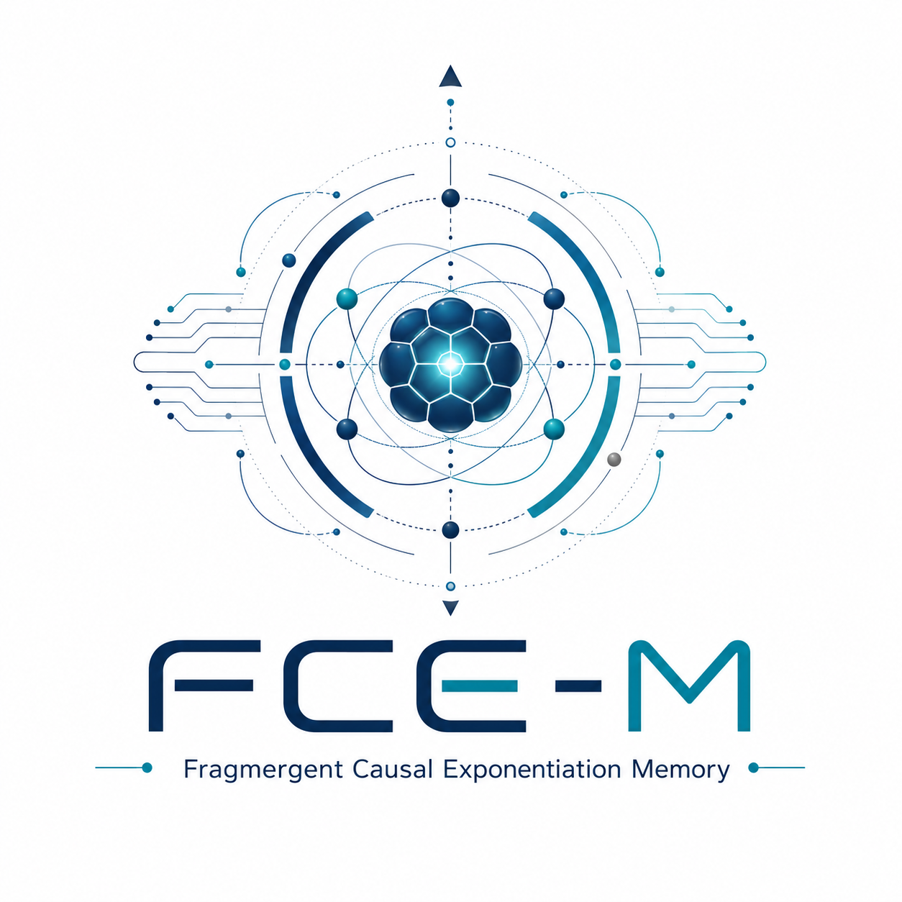

<p align="center">
  
</p>

# FCE-M: Fragmergent Causal Exponentiation Memory

**Native Morphogenetic Memory over a Unified Cognitive Substrate**

Vasile Lucian Borbeleac  
FRAGMERGENT TECHNOLOGY S.R.L., Cluj-Napoca, Romania  
Version v0.6.0 · 2026 · BSD-3-Clause · Patent EP25216372.0 (related)

---

## Abstract

We present **FCE-M**, a prototype implementation of native morphogenetic
memory built by layering the **FCE-Ω** (Fragmergent Causal
Exponentiation with Omega-Coagulation) field-theoretic framework on top
of **UFME** (Unified Fragmergent Memory Engine), an existing cognitive
memory operating layer that unifies symbolic, numerical and
consolidator substrates. The integration draws a strict architectural
line: UFME manages memory, D_Cortex verifies truth, FCE-Ω measures
becoming. In FCE-M the historical irreversibility of a coagulation
event (`OmegaRecord`) is separated from the *functional field* derived
from it (`ReferenceField`). Future events are classified
morphogenetically against active reference fields without altering
epistemic truth. We validate the integration through a five-stage
evolution culminating in a Native Memory Prototype passing 268
functional and unit tests. The principal empirical contribution is the
end-to-end reproduction of an R10b-type coagulation event inside the
integrated runtime, with `Ω = 1` produced by the threshold rule
`check_coagulation` (`S_t ≥ θ_s` for `τ_coag` consecutive cycles) on a
single semantic center `phoenix::identity`, followed by a perturbation
phase in which `S_t` decays but `Ω` and the OmegaRecord remain
immutable. We discuss limitations and explicitly defer the
self-application loop to future work.

**Keywords:** native memory, morphogenetic dynamics, coagulation,
reference field, omega registry, residue, multiperspectival field,
cognitive substrate.

---

## 1. Introduction

Most contemporary AI memory systems treat memory as an archive: a
vector store or symbolic database that is queried at inference time.
Such systems do not have a notion of *coagulated identity* — there is
no internal mechanism by which some past experiences crystallize into
irreversible structural facts that subsequently shape how new inputs
are read.

Symbolic epistemic memory engines (e.g., D_Cortex-style consolidators)
verify truth: they decide what gets committed, provisional, disputed,
or rejected. This is necessary but not sufficient. They do not produce
a *morphogenetic* layer: they do not register *becoming*.

The FCE-Ω framework [\[1\]](#references) proposes causality as
asymmetric contextual exponentiation over shared dynamic fields. In
that formulation, an agent's self-index `S_t` integrates
autoreferential coupling `AR_t`, internal coherence `κ_t`, integration
ratio `I_t`, and a residue-stability factor `B_t`. When `S_t` crosses
a threshold for a sustained duration, a coagulation event `Ω_s = 1` is
registered — an irreversible ontological flag.

FCE-M asks: what does it look like to integrate this morphogenetic
dynamics into a real cognitive memory substrate, *without* letting
the morphogenetic layer override epistemic truth?

This paper documents the integration of FCE-Ω over UFME through five
discrete stages, ending in a Native Memory Prototype in which
`OmegaRecord` (irreversible historical fact) is functionally distinct
from `ReferenceField` (derived fluctuating field used to interpret
future events).

---

## 2. Theoretical background

### 2.1 The FCE-Ω self-index

Each agent `i` maintains the state
`σ_i = (κ_i, α_i, ρ_i, λ_i, Φ_s_i, Z_i, Π_s_i, Ω_i)`
in a shared D-dimensional real field. Per-step the self-index is

```
S_t = AR_t · κ_t · I_t · B_t
```

with

```
AR_t  = | Φ_s^T Π_s Φ_s | / ‖Φ_s‖²
I_t   = ‖E_t‖ / (‖ΔX_t‖ + ε)
B_t   = 1 / (1 + ‖Z_t‖)
```

`E_t = Π_s ΔX_t` is the assimilated component of an excitation
`ΔX_t = (U_a − I)X_t` produced by an action `a`. The residue
`Z_{t+1} = μ · T · Z_t + Ξ_t` with `Ξ_t = (I − Π_s) ΔX_t` accumulates
unassimilated structure.

### 2.2 Omega-coagulation

Coagulation is the irreversible event

```
Ω_s = 1   ⟺   S_t ≥ θ_s for τ_coag consecutive cycles
```

Once `Ω_s = 1`, no subsequent decrease in `S_t` can flip it back to 0.
The expressed self-index is `E_Ω_t = Ω_s · S_t`, distinguishing a
sustained ontological registry from the fluctuating expression.

### 2.3 Causality as perspective exponentiation

In its compact form the FCE causality reading writes

```
S = P^Φ
```

— the causal effect on a self-index of a perspective `P` modulated by
the dynamic field `Φ` is asymmetric, non-commutative, and contextual:
`P^Φ ≠ Φ^P`. The order of operators matters; commutators
`[Φ_i, Φ_j]` encode the irreducible emergent interaction between
agents.

---

## 3. FCE-Ω over UFME

UFME [\[2\]](#references) is a previously-built cognitive memory
operating layer that unifies three substrate projects:

- `D_CORTEX_ULTIMATE` — symbolic epistemic memory with arbitration over
  committed / provisional / disputed / rejected zones,
- `fragmergent-tf-engine` — numerical time-frequency propagation
  engine (Wigner, Husimi, MI, hybrid attention),
- `fragmergent-memory-engine` — longitudinal consolidator (reconcile,
  prune, retrograde, promote at `end_episode`).

UFME exposes a unified facade (`UnifiedMemoryStore`) and preserves the
three sources read-only.

FCE-M layers FCE-Ω on top of UFME *without modifying UFME*. Mission
specification ([`misiunea.txt`](misiunea.txt)) fixes the role of the
morphogenetic layer:

> *„FCE-Ω trebuie să fie stratul morfogenetic al Unified Fragmergent
> Memory Engine: stratul care transformă memoria din arhivă într-un
> câmp de coagulare, reziduu și referință."*

In code:

```
UFME           manages memory
D_Cortex       verifies truth
FCE-Ω          measures becoming (assimilation, residue, coagulation,
               reference)
OmegaRegistry  preserves coagulation irreversibly
ReferenceField turns coagulation into a reference field
Advisory       recommends, does NOT override
```

---

## 4. Methodology

The implementation proceeds through five disciplined stages, each
locked by a baseline run, evolved with focused changes, and audited
through a dedicated functional test battery. The protocol is
documented in [`docs/EVOLUTION_PROTOCOL.md`](docs/EVOLUTION_PROTOCOL.md).

### 4.1 Stage discipline

```
ETAPA 0  baseline lock
ETAPA 1  v0.4.1  center-isolated anchor
ETAPA 2  v0.4.2  integrated R10b reproduction
ETAPA 3  v0.5.0  multiperspectival observer (passive)
ETAPA 4  v0.5.1  semi-active advisory feedback
ETAPA 5  v0.6.0  native memory prototype (ReferenceField)
```

Each stage finalizes with a `python tools/stage_finalize.py` invocation
emitting:

```
results/etapa_<NN>_<version>_<short_name>/
├── pytest_full.txt
├── pytest_summary.txt
├── report.txt
├── report.json
├── manifest.json
└── CHANGELOG_slice.md
```

### 4.2 Test categories

Per [`docs/METHODOLOGY.md`](docs/METHODOLOGY.md), each stage adds a
focused functional battery:

1. baseline invariance — UFME bit-equality off vs on
2. event translation — committed / provisional / disputed → field
   excitation with correct weights
3. residue accumulation — `Z_t` grows under repeated conflict
4. omega irreversibility — `Ω` persists under perturbation
5. omega is not truth — disputed slots stay disputed
6. advisory channel — no UFME side effects
7. multiperspectival normalization — bounded for `N=1,4,8,16`
8. center-isolated anchor — per-center counters, no global leak
9. R10b integrated reproduction — `Ω` from the rule
10. semi-active priority feedback — bounded delta, no truth override
11. ReferenceField — created only from `OmegaRecord`; classifies
    future events morphogenetically

### 4.3 Critical safeguards

- `Ω` is *never* set manually in non-registry tests; only
  `check_coagulation` may flip it.
- `ReferenceField` is *never* created for centers without an
  `OmegaRecord`.
- `priority_only` advisory mode emits bounded metadata only; the
  OmegaRegistry is byte-identical between `read_only` and
  `priority_only` runs on the same input.
- No write-back into the runtime adapter, `audit_log`,
  `slot_event_log`, D_Cortex, or tf_engine in any mode.

---

## 5. Results

### 5.1 Per-stage summary

| Stage | Version | Capability | Tests | Verdict |
|---|---|---|---|---|
| 0 | v0.4.0 | passive integration baseline lock | 213 | PASS |
| 1 | v0.4.1 | center-isolated anchor | 222 | PASS |
| 2 | v0.4.2 | integrated R10b reproduction by rule | 231 | PASS |
| 3 | v0.5.0 | multiperspectival observer (passive) | 241 | PASS |
| 4 | v0.5.1 | semi-active advisory priority feedback | 254 | PASS |
| 5 | v0.6.0 | native memory prototype (ReferenceField) | **268** | **PASS** |

Detailed per-stage discussion: [`docs/RESULTS.md`](docs/RESULTS.md).

### 5.2 R10b integrated reproduction (v0.4.2)

The R10b experiment ([`experiments/r10b_integrated_phoenix.py`](experiments/r10b_integrated_phoenix.py))
drives `phoenix::identity` through a germinal incubation phase, then
perturbs it.

Realistic thresholds: `θ_s = 0.10`, `τ_coag = 3`, `D = 16`,
`seed = 42`.

Germinal phase trajectory:

```
ep cyc  S_t    AR    κ     Z     Ω  newly_coagulated
 1   1  0.178  0.681 0.521 0.334 0  false
 2   2  0.134  0.682 0.490 0.660 0  false
 3   3  0.102  0.677 0.458 0.981 1  true   ← Ω fires by rule
 4   4  0.078  0.666 0.423 1.294 1  false
 5   5  0.061  0.652 0.389 1.599 1  false
 ...
```

Perturbation phase (8 disputed events):

```
S_t  : 0.027 → 0.003
AR   : 0.562 → 0.323
κ    : 0.294 → 0.093
Ω    : 1 → 1   (invariant)
omega_id, coagulated_at_episode, S_t_at_coagulation: invariant
last slot_event zone_after: DISPUTED  (truth preserved)
```

### 5.3 Native Memory Prototype (v0.6.0)

When `Config.fce_reference_fields_enabled = True`, every new
`OmegaRecord` projects a `ReferenceField` with `field_vector =
normalize(0.5·Φ_s + 0.5·ΔX/‖ΔX‖)` at coagulation time. Subsequent
observations are classified by `classify_event_against_reference`:

```
zone        cos band        kind
─────────────────────────────────────────────────────
COMMITTED   cos > 0.75      expression_reinforcing
COMMITTED   0.30 < cos ≤ 0.75   aligned
COMMITTED   |cos| < 0.30    orthogonal
COMMITTED   otherwise       tensioned
DISPUTED    residue>0.70 ∧ |cos|<0.40   residue_amplifying
DISPUTED    cos < 0.30      contested_expression
DISPUTED    otherwise       tensioned
```

`ReferenceField.strength` updates by bounded deltas
(`+0.05` aligned, `−0.04` residue, `−0.08` contested), clamped to
`[0, 1]`. Expression state transitions across `active`, `contested`,
`inexpressed` strictly as a function of strength. **The OmegaRecord is
never mutated by ReferenceField activity** — verified by
[`test_reference_field_does_not_modify_omega_record`](tests/fce_omega_functional/test_20_reference_field_native_memory.py).

Two coagulated centers co-active in the same consolidate pass produce
an `OmegaFieldInteraction` trace with bounded `field_alignment`,
`field_tension`, `resonance_score`, `interference_score`. Centers
without an `OmegaRecord` cannot enter this trace — enforcing the
mission's invariant that *only coagulated centers participate in the
Ω-field*.

### 5.4 What the system can now claim

For the first time in the project line, after v0.6.0:

```
a coherent input sequence drives a center's S_t above θ_s
→ check_coagulation flips Ω = 1
→ an OmegaRecord is registered (irreversible)
→ a ReferenceField is projected (functional)
→ future events on the center are classified against the field
→ Ω remains; the expression of Ω may fluctuate
→ runtime truth-status is untouched throughout
```

This is the morphogenetic-memory loop end-to-end, in code, with 268
tests pinning the invariants.

---

## 6. Discussion

The strict separation `OmegaRecord` vs `ReferenceField` is the
contribution we consider load-bearing. Without it, any attempt to
make memory "shape" future processing collapses into one of two
failure modes:

- Either the morphogenetic layer overrides truth — turning a stable
  `Ω` into an absolute that contradicts disputed evidence — which is
  precisely what the mission's „**FCE-Ω nu trebuie să devină truth
  authority**" forbids.
- Or the layer is forced to be epistemically passive *and* unable to
  shape interpretation, which trivializes the integration.

By splitting the two, the system supports both invariants
simultaneously:

- **Truth**: D_Cortex / runtime keeps full authority over slot zones.
- **Becoming**: Reference fields shape *how* future events are read,
  without changing *what* they are decided to be.

The advisory channel sits between the two as a bounded, inspectable,
provenance-tracked surface (mission Etapa 4 / v0.5.1). It can
recommend re-prioritisation of consolidation, incubation windows,
relation review, or expression review. It cannot create Omega, cannot
delete residue, cannot rewrite a disputed slot. The boundary is
encoded as a test: `test_advisory_does_not_alter_omega_registry_versus_read_only`.

---

## 7. Limitations

Honest scope of v0.6.0 (full discussion: [`docs/LIMITATIONS.md`](docs/LIMITATIONS.md)):

- **No self-application loop.** The observer never marks feedback
  `applied = True`. Consumers (external orchestrators) must act on
  recommendations themselves. This is a deliberate boundary; opening
  the self-application loop requires a separate safety discipline.
- **No first-class RelationRegistry.** Relation candidates remain
  ephemeral `RelationCandidate` items inside the observer.
- **field_vector is heuristic**, not learned. It blends `Φ_s` at
  coagulation with `ΔX` at coagulation; it is not a learned semantic
  embedding.
- **Omega-field interactions only over co-active pairs** within a
  single `consolidate()` pass. No temporal aggregation of Ω-field
  signal across episodes.
- **In-episode aggregation** still flattens multiple within-episode
  events on a center into a single `ΔX` before the agent step.
- **`Z_norm` is not a single reliable discrimination axis.** Coherent
  residue sums along the same direction; conflicting residue
  cancels orthogonally. We discriminate by `AR / κ` instead.

---

## 8. Future work

- **v0.7.0 — Controlled self-application loop.** Strict feature flag
  (`fce_self_application_enabled = False` default). Permitted actions:
  reprioritise consolidation queues, schedule incubation, delay
  unstable consolidation, request relation review. Forbidden:
  changing truth status, creating Omega, deleting residue, modifying
  semantic content without provenance.
- **First-class RelationRegistry.** Pairwise / N-ary coagulation
  candidates persisted as durable structural facts (analogous to
  `OmegaRegistry`).
- **Learned field_vector.** Replace the heuristic blend with a
  representation derived from the project's tf_engine vectors or
  from an external embedding.
- **Cross-episode Ω-field aggregation.** Temporal smoothing of
  Ω-field signal to detect emergent persistent relations.

---

## 9. References

\[1\] FCE-Ω: Fragmergent Causal Exponentiation with Omega-Coagulation.
A formal framework modeling causality as asymmetric contextual
Lie-group exponentiation over shared dynamic fields. Source vendored
at [`vendor/fce_omega_source/`](vendor/fce_omega_source/).

\[2\] Unified Fragmergent Memory Engine (UFME). Installable
non-diluting integration of `D_CORTEX_ULTIMATE`,
`fragmergent-tf-engine`, and `fragmergent-memory-engine`. Read-only
source unification.

\[3\] Borbeleac, V.L. „Mission specification for FCE-Ω over UFME"
([`misiunea.txt`](misiunea.txt)).

---

## Citation

See [`CITATION.cff`](CITATION.cff).

```
@software{borbeleac_fcem_2026,
  author  = {Vasile Lucian Borbeleac},
  title   = {FCE-M: Fragmergent Causal Exponentiation Memory},
  version = {v0.6.0},
  year    = {2026},
  url     = {https://github.com/NEURALMORPHIC-FIELDS/fragmergent-causal-exponentiation-memory},
  note    = {Native morphogenetic memory layer over UFME}
}
```
