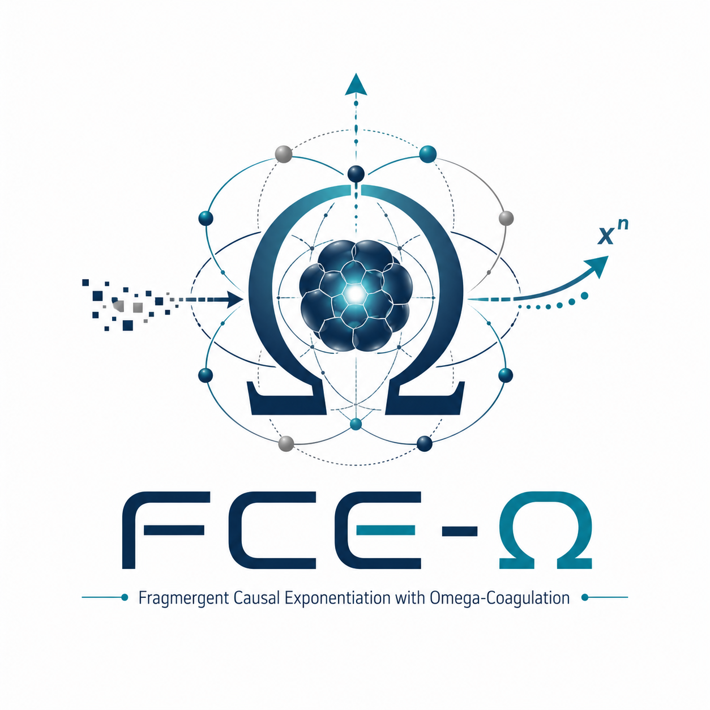

  

# FCE-Ω Changelog

All notable developments in the FCE-Ω framework are documented here.
Format follows [Keep a Changelog](https://keepachangelog.com/en/1.0.0/).

---

## [0.11.0] — 2026-05 — R11 Ablation Study

### Added
- R11a/R11b ablation: anchor ON (γ=0.35) vs anchor OFF (γ=0).
- Pair Omega-Coagulation registry with pair_cycle tracking.

### Findings
- Secondary coagulations (1/3 agents) occur at t=23 with identical timing
  in both R11a and R11b.
- **Principal result**: germinal condition of secondary agents is the primary
  determinant of secondary coagulation. Anchor coupling at γ=0.35 does not
  modify timing or frequency in this parameter regime.
- Ontological conclusion: a coagulated center (Ω=1) functions as a relational
  reference field but cannot substitute the internal germinal condition of
  secondary centers.

---

## [0.10.0] — 2026-05 — R10b: First Confirmed Coagulation

### Added
- Two-phase regime: Phase 1 (uniperspectival germinal incubation) +
  Phase 2 (normalized multiperspectival entry).
- Unidirectional homeostatic α recovery: `homeo = r_α · C · max(0, α_ref - α)`.

### Fixed
- Critical bug in R10: bidirectional homeostasis suppressed α when α > α_ref,
  pulling it down toward α_ref and reducing I_t below threshold before
  τ_coag = 12 consecutive cycles could be reached.
- Corrected to unidirectional: only upward pull when α < α_ref.

### Findings
- **First confirmed integrative coagulation**: Ω_0 = 1 at t=11, κ=0.612.
- Phase 2 entry at t=11; agents 1–3 with κ_sec=0.68 produce 1/3 secondary
  coagulations at t=23, κ=0.773 (integrative).
- Omega-Coagulation Registry confirmed irreversible across 989 subsequent cycles.

---

## [0.9.0] — 2026-05 — R9: Normalized Multiperspectival Field

### Added
- Per-class normalization of field update:
  - Individual terms: `/N`
  - Directed pair terms: `/N(N-1)`
  - Shared nuclei: `/N(N-1)/2`

### Findings
- Field stability restored (‖X‖ remains 1.0–1.8 vs 2.3+ in R8).
- Germinal window for agent 0 still insufficient for coagulation in 1000 cycles.
- Residue production from other agents' field contributions rotates X,
  increasing Xi for agent 0 even under normalized conditions.
- **Conclusion**: R10 (protected incubation) validated as next required test.

---

## [0.8.0] — 2026-05 — R8: Multiperspectival N=4

### Added
- N=4 agent multiperspectival regime with directed interaction operators:
  absorption, repulsion, interference [Φ_i, Φ_j], directional coagulation.
- Shared Omega_pair registry for relational nuclei.
- Asymmetric start: agent 0 at κ=0.85, agents 1–3 at κ=0.55.

### Findings
- Without normalization, field intensity scales as O(N) individual + O(N²) pairs.
- Artificial field turbulence (×3–4 vs uniperspectival) fragments all centers
  before any coagulation can occur.
- **Conclusion**: per-class normalization is required (→ R9).

---

## [0.7.0] — 2026-05 — R5–R7: Alpha Recovery Variants

### Added
- R5: Independent self-coupling floor `w_self = λ·(α_floor_self + α·M_mix)`.
- R6: Omega-Coagulation Registry introduced. Bidirectional homeostatic α recovery.
- R7a: Homeostasis decoupled from ‖Z‖: `C_α = 1/(1+ρ)`.
- R7b: Same with r_α = 0.12.

### Findings
- R5: AR stabilizes at 0.21 when α→0.01; insufficient regen budget to sustain κ.
- R6: Bidirectional homeostasis suppresses high-α states; bug identified.
- R7a/R7b: Budget analysis shows required r_α ≈ 0.24 for balance at ρ=1.5.
- Root cause: κ collapses in ~34 steps (faster than any homeostatic response).

---

## [0.4.0] — 2026-05 — R3–R4: Π_s Non-Degeneracy

### Added
- R3: κ regeneration term `γ_self · λ · coh(E, Φ_s) · I_t · B_t`.
- R4: Non-degenerate Π_s preventing rank-1 collapse at λ→1.

### Findings
- R3: κ regeneration succeeds partially (30% operational Sine) via rank-1
  degeneracy creating tunnel autoreferentiality. Not integrative Sine.
- R4: Non-degenerate Π_s is ontologically correct but self_weight = α·M_mix·λ
  decouples autoreferential channel when α→0.01.
- **Critical insight**: autoreferential closure and integrative coherence
  compete rather than reinforce under current architecture.

---

## [0.2.0] — 2026-05 — R1–R2: Π_s Calibration

### Added
- R1: Global Π_s = α·I (corrected from (α/D)·I).
- R2: Germinal seed with λ_0 = ε = 0.01.

### Findings
- R1: Collapse of α was artifact of (α/D) sub-assimilation. AR reaches 1.0
  (λ saturates) but κ collapses to 0.01 → reflexive instability, not Sine.
- R2: 90.8% autoreferential in early cycles; field explosion at t≈900 due to
  missing dissipation. Identified need for field norm regulation.

---

## [0.1.0] — 2026-05 — R0: Baseline and Theoretical Foundation

### Added
- Core mathematical framework: U_a = exp(Φ_a), asymmetric contextual exponentiation.
- Assimilation/residue decomposition: E_t, Ξ_t, Z_t.
- Subject state σ = (κ, α, ρ, λ) with coupled update equations.
- Self-Index S_t = AR · κ · I_t · B_t.
- Three-level interiority hierarchy: structural / informational / autoreferential.

### Findings
- R0 (sub-assimilative, Π_s = (α/D)·I): autocatalytic fragmentation.
  Spiral: low E → high Ξ → high ρ → low α → lower E.
- Confirmed: the spiral is an internal law of the model, not a parameter artifact.
- Established need to distinguish reflexive instability from integrative Sine.
